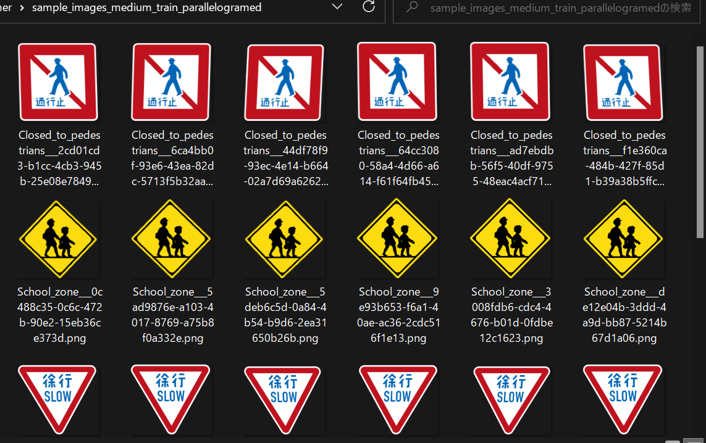

<h1> ImageTransformer (Updated: 2022/05/12)</h1>
This is a set of simple ImageTranformers.  
The sample images have been taken from 
<a href="https://en.wikipedia.org/wiki/Road_signs_in_Japan">Road_signs_in_Japan</a> 
 
<a href="#1">1 ImageColorEnhancer</a> 
<a href="#2">2 ImageWarpRotator</a> 
<a href="#3">3 ImageWarpTrapezoider</a> 
<a href="#4">4 ImageWarpParallelogramer</a> 
 
<h2><a name="1">1 ImageColorEnhancer</a></h2>

Usage: 

python <a href="./ImageColorEnhancer.py">ImageColorEnhancer.py</a> colorenhancer.conf all/train/valid/tes 
 
colorenhancer.conf
<pre>
;colorenhancer.conf

[train]

input_dir    = "./sample_images_medium"
output_dir   = "./sample_images_medium_train_colorenhanced"
max_enhancer = 10
color_params  = [0.82, 0.86, 0.90, 0.94, 0.98, 1.02, 1.06, 1.10, 1.14, 1.18 ]

[valid]
input_dir  = "./sample_images_medium"
output_dir = "./sample_images_medium_valid_colorenhanced"
max_enhancer = 4
color_params  = [ 0.90, 0.94, 0.98, 1.02, 1.06, 1.10, ]

[test]
input_dir  = "./sample_images_medium"
output_dir = "./sample_images_medium_test_colorenhanced"
max_enhancer = 2
color_params  = [0.86,  0.94, 1.06,  1.14, ]

</pre>
 
Example 
<pre>
python ImageColorEnhancer.py ./sample_images_medium colorenhancer.conf train
</pre>
 
<a href="./sample_images_medium_train_colorenhanced">Color Enhanced</a>
 
 
 

<h2><a name="2">2 ImageWarpRotator</a></h2>

Usage: 
python <a href="./ImageWarpRotator.py">ImageWarpRotator.py</a> rotator.conf all/train/valid/test 
 
rotator.conf
<pre>
;rotator.conf

[train]
input_dir   = "./sample_images_medium"
output_dir  = "./sample_images_medium_train_rotated"
angles      = [-5. -4. -3,-2, 2, 3, 4, 5] 

[valid]
input_dir  = "./sample_images_medium"

output_dir = "./sample_images_medium_valid_rotated"
angles  = [-2,-1, 1, 2,] 

[test]
input_dir  = "./sample_images_medium"
output_dir = "./sample_images_medium_test_rotated"
angles  = [ -1, 1,] 
</pre>
 
Example 
<pre>
python ImageWarpRotator.py ./rotator.conf train
</pre>
 
<a href="./sample_images_medium_train_rotated">Rotated</a>
 
 
 

<h2><a name="3">3 ImageWarpTrapezoider</a></h2>

Usage: 
python <a href="./ImageWarpTrapezoider.py">ImageWarpTrapezoider.py</a> trapezoider.conf all/train/valid/test 
 
trapezoider.conf
<pre>
;trapezoider.conf

[train]

input_dir   = "./sample_images_medium"
output_dir  = "./sample_images_medium_train_trapezoided"
policy      = 2
ws_list     = [0.01, 0.02, 0.03, 0.05]
hs_list     = [0.01, 0.02, 0.03, 0.05]

[valid]
input_dir  = "./sample_images_medium"

output_dir = "./sample_images_medium_valid_trapezoided"
policy     = 2
ws_list    = [0.02, 0.03, 0.06]
hs_list    = [0.02, 0.03, 0.06]

[test]
input_dir  = "./sample_images_medium"
output_dir = "./sample_images_medium_test_trapezoided"
policy     = 2
ws_list    = [0.01]
hs_list    = [0.03]

</pre>
Example 
<pre>
python ImageWarpTrapezoider.py ./trapezoider.conf train 
</pre>
 
<a href="sample_images_medium_train_trapezoided">Trapezoided</a>
 
 
 

 
 <h2><a name="4">4 ImageWarpParallelogramer</a></h2>

Usage: 
python <a href="./ImageWarpParallelogramer.py">ImageWarpParallelogramer.py</a> parallelogramer.conf all/train/valid/test 
 
parallelogramer.conf
<pre>
;parallelogramer.conf

[train]
input_dir   = "./sample_images_medium"
output_dir  = "./sample_images_medium_train_parallelogramed"
ws_list     = [-0.05, -0.03, 0.02, 0.02, 0.03, 0.05]

[valid]
input_dir  = "./sample_images_medium"
output_dir = "./sample_images_medium_valid_parallelogramed"
ws_list    = [-0.06, -0.04, 0.04, 0.06]

[test]
input_dir  = "./sample_images_medium"
output_dir = "./sample_images_medium_test_parallelogramed"
ws_list    = [-0.01, 0.01]
</pre>
Example 
<pre>
python ImageWarpParallelogramer.py ./parallelogramer.conf train
</pre>
 
<a href="sample_images_medium_train_parallelogramed">Parallelogramed</a>
 
 
 

