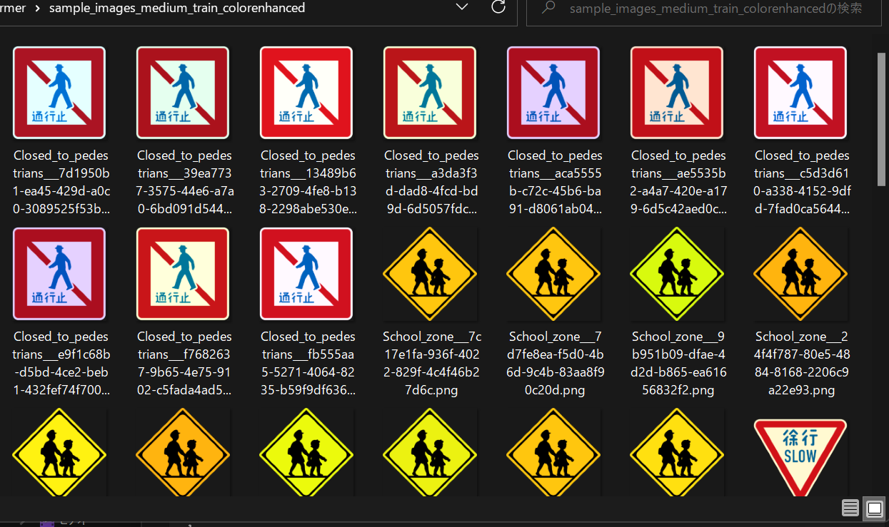

<h1> ImageTransformer</h1>
This is a set of simple ImageTranformers.  
The sample images have been taken from <a href="https://en.wikipedia.org/wiki/Road_signs_in_the_United_States">Road signs in the United States</a> 
<h2>1 ImageColorEnhancer</h2>

Usage: 
python <a href="./ImageColorEnhancer.py">ImageColorEnhancer.py</a> images_dir mode output_dir max 

Example 
<pre>
python ImageColorEnhancer.py ./sample_images train ./sample_images_train_color_enhanced 5
</pre>
 
<a href="./sample_images_train_color_enhanced">Color Enhanced</a>
 
 
 

<h2>2 ImageWarpRotator</h2>

Usage: 
python <a href="./ImageWarpRotator.py">ImageWarpRotator.py</a> images_dir mode output_dir 

Example 
<pre>
python ImageWarpRotator.py ./sample_images train ./sample_images_train_rotated

</pre>
 
<a href="./sample_images_train_rotated">Rotated</a>
 
 
 

<h2>3 ImageWarpTrapezoider</h2>

Usage: 
python <a href="./ImageWarpTrapezoider.py">ImageWarpTrapezoider.py</a> images_dir mode output_dir 

Example 
<pre>
python ImageWarpTrapezoider.py ./sample_images train ./sample_images_train_trapezoided
</pre>
 
<a href="sample_images_train_trapezoided">Trapezoided</a>
 
 
 

